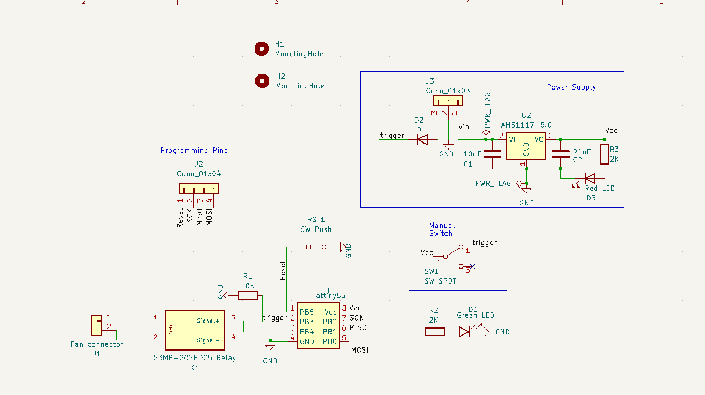

# Glowforge External Fan Controller

**Note: This will avoid any warranty of glowforge**

This program is designed to read the voltage from the fan pin on the Glowforge laser cutter. When the pin is high, a relay is turned on to run an exhaust fan. After the voltage drops back to 0, the fan runs for a little longer to allow for better exhaust of fumes.

## Components

To make the controller the following components are needed: 
1. Attiny85.
2. 5V Regulator.
3. AC Relay, with activation voltage of 3.3V or 5V.
4. Red led.
5. Green led.
6. 10K Resistor.
7. 2 x Resistor for LEDs (depends on brightness).
8. Diode.
9. 10uF Capacitor.
10. 22uF Capacitor.
11. Momentary Push Button.
12. Slide Switch.
13. Terminal Block.
14. JST Connector.
15. Pin Headers.

Also needed is some arduino board to program the attiny85.

DigiKey (https://www.digikey.ca/) is a great place to buy electronics from.

The attiny85 is very small microcontroller, convienent for simple projects. The AC relay is used to run an external exhaust fan when the controller senses high voltage. The red led is used to notify that the controller has power, and the green is show that relay should be running (which is useful for debugging if the fan should be run and it's not). The button is used a reset and the switch is used to manually active the relay.

## Diagrams
 
